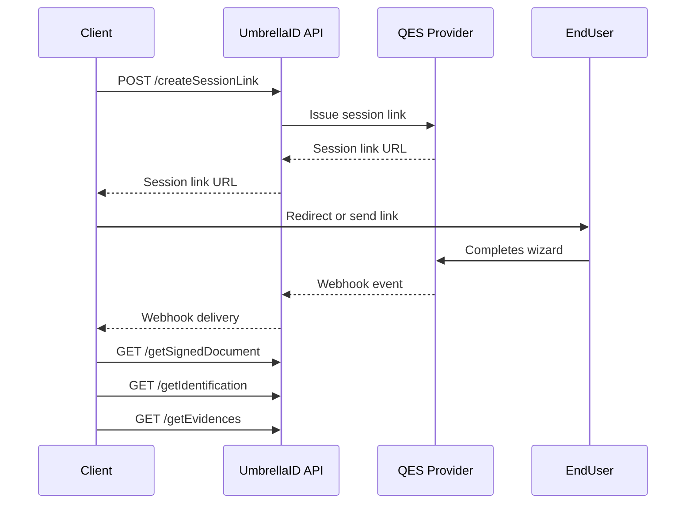

import Auth from '/snippets/auth.mdx';

# QES Onboarding API - Detailed Documentation

The QES Onboarding API allows you to initiate and manage qualified electronic signature (QES) workflows via a secure and customizable interface. This includes creating signing sessions, configuring webhooks for status updates, and retrieving verification results for audit or compliance checks.

### API Playground:
<Tabs>
  <Tab title="/onboarding/createSessionLink">
    You can try the create session link endpoint [here](/api-reference/endpoint/qesOnboarding_createSessionLink).
  </Tab>
  <Tab title="/onboarding/configureWebhook">
    You can try the configure webhook endpoint [here](/api-reference/endpoint/qesOnboarding_configureWebhook).
  </Tab>
  <Tab title="/onboarding/getVerification/{sessionId}">
    You can try the get verification endpoint [here](/api-reference/endpoint/qesOnboarding_getVerification).
  </Tab>
</Tabs>

## Endpoints Overview

1. **Create Session Link**: Initiates a QES signature session and returns a unique user signing URL.
2. **Configure Webhook**: Registers a webhook to receive real-time updates for the onboarding session.
3. **Get Verification**: Retrieves the full verification result for a specific onboarding session.


## Sequence Diagram


### How to Prepare a PDF Document for QES
To ensure successful signing:

1. **Use Adobe Acrobat (Standard or Pro)** to open your PDF.
2. Go to **Tools → Prepare Form**.
3. Insert at least one **Signature Field** where the user will sign.
   - The field must be a digital signature field (not just a form input).
4. Add **text fields (AcroFields)** that can be dynamically filled during onboarding using `fillform`. These fields support placeholder variables to auto-populate identity data.
5. Save the document and host it at a publicly accessible HTTPS URL.

**Supported dynamic variables:**
| Variable                              | Description                   |
|---------------------------------------|-------------------------------|
| `${identification.firstName}`         | First name of the user        |
| `${identification.lastName}`          | Last name of the user         |
| `${identification.email}`             | Email address                 |
| `${identification.phoneNumber}`       | Mobile number                 |
| `${identification.birthDate}`         | Date of birth                 |
| `${identification.gender}`            | Gender                        |
| `${identification.personalNumber}`    | Personal identifier           |
| `${identification.documentDetails.number}` | ID document number       |

These fields must have matching `fieldId`s in the `fillform` array passed to the API. Onboarding will then substitute them with the correct values.

<Note>Only AcroForm-compatible PDFs are supported. PDFs generated with third-party editors may not be recognized.</Note>

---
<Auth/>
---

## 1. Create Session Link
### Endpoint
**POST** `/onboarding/createSessionLink`

### Description
Starts a QES signing session for a specified user. Returns a URL that redirects the user to the signing wizard. The backend will send this session link to the user for document signing.

### Required Headers

| Header        | Value                    |
| ------------- | ------------------------ |
| Content-Type  | `application/json`       |
| Authorization | `Bearer yourAccessToken` |

### Request Body Parameters
<Accordion title="Request Body Parameters">
| Field                   | Type   | Required | Description                                                   |
|-------------------------|--------|----------|---------------------------------------------------------------|
| email                   | string | Yes      | User's email address.                                         |
| phoneNumber             | string | Yes      | User's phone number (E.164 format).                           |
| firstName               | string | Optional      | User's first name.                                            |
| lastName                | string | Optional      | User's last name.                                             |
| redirectUrl             | string | Yes     | Redirect URL.                                           |
| docUrl                  | string | Yes      | URL of PDF to sign. Must be accessible online.               |
| signforms               | array  | Optional | Signature fields in the PDF (AcroForm field IDs).             |
| fillform                | array  | Optional | Pre-fillable text fields in the PDF.                          |
</Accordion>

### Response Structure
<Accordion title="Response Structure">
| Field             | Type   | Description                                  |
|-------------------|--------|----------------------------------------------|
| success           | bool   | Whether the request was successful.          |
| data.url          | string | URL to redirect user to the signing wizard.  |
| data.expiresAfter | string | ISO timestamp for session expiration.        |
</Accordion>

### Example Request
```json
{
  "email": "support@idcanopy.com",
  "phoneNumber": "+393358021530",
  "firstName": "MARIA",
  "lastName": "SPECIMEN",
  "redirectUrl": "https://google.com",
  "docUrl": "https://cdn.idcanopy.com/pdf/onb-t3.pdf"
}
```

### Example Response
```json
{
  "success": true,
  "data": {
    "requestId": "68d14dd8-ca21-41da-8679-12345678909876",
    "url": "https://test.idcanopy.com/api/v2/voucher/start?...",
    "expiresAfter": "2025-05-28T18:33:25.778Z"
  }
}
```

<Note>To enable successful qualified signing, the document must include AcroForm-compatible signature fields created with Adobe Acrobat. Clients are responsible for preparing their own PDF templates and hosting them at a secure public URL.</Note>


## 2. Configure Webhook
### Endpoint
**POST** `/onboarding/configureWebhook`

### Description
Registers a webhook URL to receive onboarding status updates such as completed verification, signing, or failures.

### Required Headers
| Header        | Value                    |
| ------------- | ------------------------ |
| Content-Type  | `application/json`       |
| Authorization | `Bearer yourAccessToken` |

### Request Body Parameters
<Accordion title="Request Body Parameters">
| Field       | Type   | Required | Description                 |
|-------------|--------|----------|-----------------------------|
| webhookUrl  | string | Yes      | URL to receive status pings |
</Accordion>

### Response Structure
<Accordion title="Response Structure">
| Field         | Type   | Description                     |
|---------------|--------|---------------------------------|
| success       | bool   | Indicates if webhook was saved. |
| data.id       | string | Internal webhook ID.            |
| data.url      | string | Registered webhook URL.         |
| data.createdAt| string | Timestamp of creation.          |
</Accordion>

### Example Request
```json
{
  "webhookUrl": "https://api.idcanopy.com/webhooks/onboarding"
}
```

### Example Response
```json
{
  "success": true,
  "data": {
    "id": "74884fe3-c9e1-4462-b60f-c461e422000c",
    "url": "https://api.idcanopy.com/webhooks/onboarding",
    "createdAt": "2025-05-08T16:39:28.339Z"
  }
}
```

## 3. Get Verification
### Endpoint
**GET** `/onboarding/getVerification/{sessionId}`

### Description
Retrieves identity and signature verification results for a given onboarding session ID.

### Required Headers
| Header        | Value                    |
| ------------- | ------------------------ |
| Content-Type  | `application/json`       |
| Authorization | `Bearer yourAccessToken` |

### URL Path Parameters
<Accordion title="Path Parameters">
| Parameter  | Type   | Required | Description                     |
|------------|--------|----------|---------------------------------|
| sessionId  | string | Yes      | ID from the onboarding session. |
</Accordion>

### Response Structure
<Accordion title="Response Structure (sample)">
| Field                                 | Type              | Description                                                                 |
|---------------------------------------|-------------------|-----------------------------------------------------------------------------|
| status                                | boolean           | Indicates whether the request was successful                                |
| data                                  | object            | Contains verification-related data                                          |
| data.isVerified                       | boolean           | Indicates whether the verification was successful                           |
| data.status                           | string            | Verification status (`completed`, `error`, `cancelled`)                     |
| data.message                          | string            | Status message                                                              |
| data.requestId                        | string            | Unique ID for the verification request                                      |
| data.signature                        | object            | Signature metadata and document references                                  |
| data.signature.content                | array of objects  | Each object contains signature method, resources, and metadata              |
| data.identification                   | object            | Identification data including person info, artifacts, and status            |
| data.identification.status            | string            | Final status of the identification flow (`COMPLETED`, etc.)                 |
| data.identification.personData        | object            | Extracted personal information (name, date of birth, etc.)                  |
| data.identification.documentDetails   | object            | Issued ID document details                                                  |
| data.identification.idSelf.artifacts  | object            | Media files collected during identification (biometry, document)           |
| data.identification.idSelf.biometryCheck | object         | Biometric validation result summary                                         |
| data.identification.idSelf.documentCheck | object         | Document analysis result summary                                            |
| data.identification.validationDetail  | object            | Per-field source/validation indicators (e.g., `byRequestInput`, `otpValidated`) |
</Accordion>

### Example Response Completed Case
<Accordion title="Example Response Completed Case">
```json
{
  "status": true,
  "data": {
    "isVerified": true,
    "status": "completed",
    "message": "Verification completed",
    "requestId": "64d35e63-fdf4-43f6-8459-1216787fb34e",
    "signature": {
      "content": [
        {
          "id": "e919520e-bb24-41c3-8a7b-88b3c8b0008b",
          "method": "RemoteSignatureLongLivedDisposableCertificate",
          "status": "COMPLETED",
          "pageMode": "headless",
          "signedAt": "2025-06-11T11:53:04.107687Z",
          "plainResource": {
            "id": "5a28c0e7-a57e-4bb5-88f3-6b6bb47c2cf7",
            "name": "Document To Sign",
            "type": "CONTRACT_DOCUMENT",
            "family": "DOCUMENT_TO_SIGN",
            "status": "AVAILABLE",
            "subType": "DOCUMENT_FLATTENED",
            "filename": "Onboarding_TEST.pdf",
            "metadata": {
              "sourceTemplateUrl": "https://files.example.com/Onboarding_TEST.pdf"
            },
            "mimeType": "application/pdf",
            "sizeBytes": 138763,
            "resourceUri": "nor://example/resource/5a28c0e7",
            "resourceUrl": "https://example.com/storage/data/Onboarding_TEST.pdf",
            "urlValidBefore": "2025-06-16T11:53:34.028Z"
          },
          "signedResource": {
            "id": "60ab66ba-3b03-477c-8936-be55b15e890f",
            "type": "CONTRACT_DOCUMENT",
            "family": "SIGNED_DOCUMENT",
            "status": "AVAILABLE",
            "filename": "Onboarding_TEST.pdf",
            "metadata": {
              "fileId": "8168e8d7-ab7b-4c6f-b19e-2fe1418da0d1",
              "workstep": "EXAMPLE_WORKSTEP_ID"
            },
            "mimeType": "application/pdf",
            "sizeBytes": 207066,
            "resourceUri": "nor://example/resource/60ab66ba",
            "resourceUrl": "https://example.com/storage/data/Onboarding_TEST_signed.pdf",
            "urlValidBefore": "2025-06-16T11:53:34.028Z"
          }
        }
      ]
    },
    "identification": {
      "id": "2b307448-4880-4d3d-b9ab-0a438298c77a",
      "actor": "userToIdentify",
      "idSelf": {
        "artifacts": {
          "biometry": [],
          "document": []
        },
        "biometryCheck": {
          "keysWithError": [],
          "controlsSummary": 0
        },
        "documentCheck": {
          "documentType": "PASSPORT",
          "keysWithError": [],
          "controlsSummary": 0,
          "documentTypeFamily": "IDENTITY_DOCUMENT"
        }
      },
      "source": "ID-SELF",
      "status": "COMPLETED",
      "personData": {
        "email": "max.mustermann@example.com",
        "gender": "M",
        "lastName": "Mustermann",
        "birthDate": "1971-01-01",
        "firstName": "Max",
        "birthPlace": "Musterstadt",
        "nationality": "DE",
        "phoneNumber": "+491234567890",
        "documentDetails": {
          "type": "Passport",
          "number": "X1234567",
          "issuedOn": "2016-01-01",
          "expiryDate": "2026-01-01",
          "issuanceCountry": "DE",
          "issuanceAuthority": "Example Authority"
        }
      },
      "finalizedAt": "2025-06-11T11:52:29.961249669Z",
      "organizationId": "example-org-id",
      "validationDetail": {
        "email": {
          "otpValidated": "SKIPPED",
          "byRequestInput": "OK",
          "requestMatched": "SKIPPED",
          "byIdentificationSource": "SKIPPED"
        },
        "gender": {
          "otpValidated": "SKIPPED",
          "byRequestInput": "SKIPPED",
          "requestMatched": "SKIPPED",
          "byIdentificationSource": "OK"
        },
        "lastName": {
          "otpValidated": "SKIPPED",
          "byRequestInput": "SKIPPED",
          "requestMatched": "OK",
          "byIdentificationSource": "OK"
        },
        "birthDate": {
          "otpValidated": "SKIPPED",
          "byRequestInput": "SKIPPED",
          "requestMatched": "SKIPPED",
          "byIdentificationSource": "OK"
        },
        "firstName": {
          "otpValidated": "SKIPPED",
          "byRequestInput": "SKIPPED",
          "requestMatched": "OK",
          "byIdentificationSource": "OK"
        },
        "phoneNumber": {
          "otpValidated": "SKIPPED",
          "byRequestInput": "OK",
          "requestMatched": "SKIPPED",
          "byIdentificationSource": "SKIPPED"
        },
        "documentNumber": {
          "otpValidated": "SKIPPED",
          "byRequestInput": "SKIPPED",
          "requestMatched": "SKIPPED",
          "byIdentificationSource": "OK"
        },
        "personalNumber": {
          "otpValidated": "SKIPPED",
          "byRequestInput": "SKIPPED",
          "requestMatched": "SKIPPED",
          "byIdentificationSource": "SKIPPED"
        }
      }
    }
  }
}
```
</Accordion>

### Example Response Failed Case
<Accordion title="Example Response Failed Case">
```json
{
    "status": true,
    "data": {
        "isVerified": false,
        "status": "cancelled",
        "message": "Sorry, we were unable to identify you automatically. You can now try again."
    }
}
``` 
</Accordion>

### Example Response Error Case
<Accordion title="Example Response Error Case">
```json
{
    "status": true,
    "data": {
        "isVerified": false,
        "status": "error",
        "message": "Verification error"
    }
}
```
</Accordion>
## Error Handling

Standardized error codes and messages are returned to indicate issues with requests or processing.

### Example Error Response

```json
{
  "error": {
    "code": "INVALID_SESSION",
    "message": "The provided session ID is invalid or expired."
  }
}
```

### Common Errors

| Code                | Description                                 |
| ------------------- | ------------------------------------------- |
| INVALID\_SESSION    | Session ID does not exist or is expired     |
| MISSING\_PARAMETERS | Required input fields are not provided      |
| UNAUTHORIZED        | Invalid or missing API key/token            |
| INTERNAL\_ERROR     | Unexpected error during processing          |
| UNSUPPORTED\_FLOW   | Requested flow is not supported by provider |

---

## Environment & Testing

### Base URLs

| Environment | Base URL                                        |
| ----------- | ----------------------------------------------- |
| Sandbox     | `https://sandbox.api.umbrellaid.com/onboarding` |
| Production  | `https://api.umbrellaid.com/onboarding`         |

> ⚠️ All test flows use mock data and static PDFs unless otherwise configured.

### Test Data

Use the following test users for sandbox environment:

```json
{
  "firstName": "Test",
  "lastName": "User",
  "email": "testuser@umbrellaid.com",
  "phoneNumber": "+491234567890"
}
```

> ⚠️ Signing links will not produce legally binding signatures in the sandbox.

---